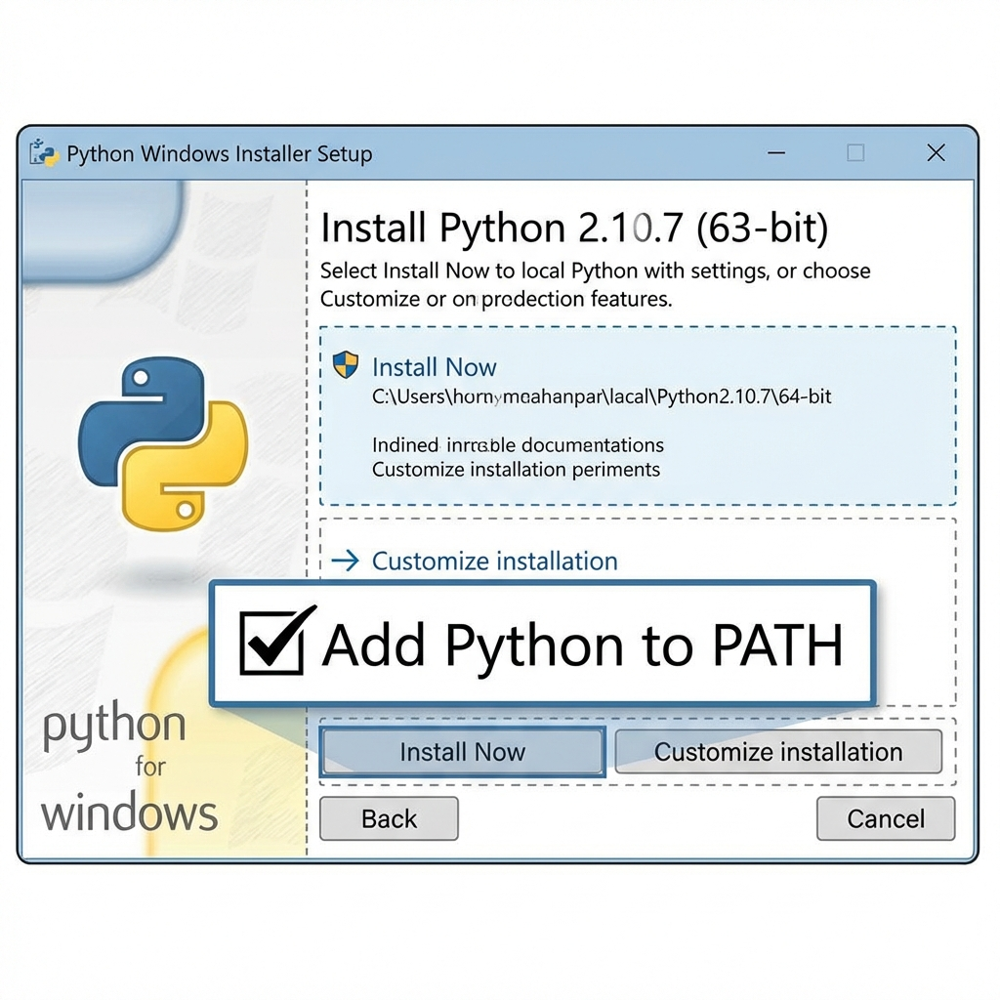

# RCSL SQL Client

A lightweight SQL client designed for securely connecting to the RCSL remote database.
Intended for users who may not be familiar with command-line operations, allowing you to get started in just a few steps.

## Quick Start

### 1. Install Python (if not already installed)
Please download and install Python (version 3.8 or higher is recommended).
- **Download Link**: [Python Official Website](https://www.python.org/downloads/)
- **Important**: During installation, make sure to check **"Add Python to PATH"** (as shown below), otherwise the script will not run.
  

### 2. Download and Run
1. Download this project (Click the green **Code** button -> **Download ZIP**) and extract it to your Desktop.
2. Open the folder and find the `run.bat` file.
3. **Double-click `run.bat`**.

### 3. Setup Credentials (First Run)
If this is your first time running the program, it will automatically create a `.env` configuration file and ask you to pause.
1. Open the `.env` file in the folder using Notepad.
2. Enter your RCSL username and password:
   ```env
   # .env file example
   API_URL="https://api.rcsl.online/sqlCommand"
   DEFAULT_USER="your_username"
   DEFAULT_PASS="your_password"
   ```
3. Save and close Notepad.
4. Double-click `run.bat` again to start the application.

---

## User Guide
- Once started, the program will automatically open your browser and navigate to the interface.
- **Do not close the black command window**, or the website will stop working.
- To exit the program, simply close the command window.

## Key Features
- **Remote Connection**: Securely connect to the RCSL database to execute queries.
- **History**: Automatically saves executed SQL commands for easy retrieval.
- **Quick Access**: Save frequently used commands to the "Quick Access" list.
- **Security**: Credentials are stored locally in the `.env` file and are never uploaded to the internet.

---

## Advanced Usage (Developers)
If you are familiar with the command line, you can also run it using the standard method:
```bash
# Create virtual environment
python -m venv venv
# Activate virtual environment (Windows)
.\venv\Scripts\activate
# Install dependencies
pip install -r requirements.txt
# Run application
python app.py
```
